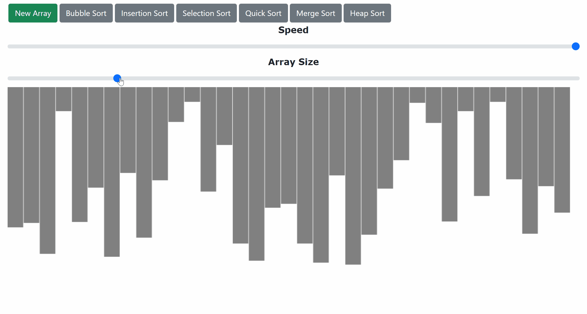

# Sorting Visualizer

<b>See how sorting algorithms works visually!</b>

## <a href="https://xjqx.github.io/Sorting-Visualizer">Website</a>

 

## Sorting Algorithms:
- **`Bubble Sort`**
- **`Insertion Sort`**
- **`Selection Sort`**
- **`Quick Sort`**
- **`Merge Sort`**
- **`Heap Sort`**
  
   
  
## Functions:
- `Change Array Size`
- `New Random Array`
- `Change Sorting Speed`
    - Sorting speed can be `changed dynamically while sorting`
    
 
   
## Animation:
- `HTML Canvas`
- 2 Ways
  - `setTimeout()`
  - `await`
- `Window`
  - Canvas and bar size `dynamically change size` when size of window is changed
